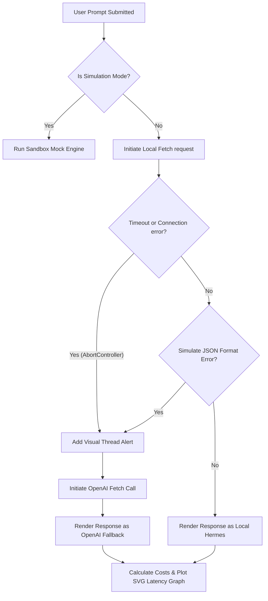

# Local Hermes with OpenAI Fallback - Client & Simulator

This is a premium, state-of-the-art Single Page Web Application designed to act as both a **fully-functional client** and an **interactive simulator** for running a local Large Language Model (like Hermes running via Ollama) with an automatic failover to the OpenAI API when the local service fails, lags, or encounters errors.

The application features a sleek obsidian dark-mode interface with **glassmorphic panels**, **dynamic HUD metric cards**, and **real-time SVG performance charts**.

---

## Key Features

1. **Intelligent Request Routing:** Attempts to resolve prompts locally using a local Ollama instance. Seamlessly routes to OpenAI if local fails or exceeds the configured timeout threshold.
2. **Dual Operational Modes:**
   - **Simulation Mode (Default):** A fully sandboxed simulation playground that runs out-of-the-box with context-aware mock LLM responses. **No API keys or installations required!**
   - **Live Connection:** Integrates directly with client-side fetches to a running local Ollama instance and the OpenAI API.
3. **Failover Simulator Control Center:** Manually trigger connection events to see how the system handles offline statuses, validation/syntax formatting failures, or latency spikes.
4. **Real-time Analytics HUD:** Displays live metrics for response latencies (visualized on a programmatically scaled SVG line graph), success/fallback counters, and a cost efficiency dashboard demonstrating accumulated dollar savings.
5. **Secure Configuration Modal:** Safely stores API keys and endpoint settings in your browser's local `localStorage`. Your OpenAI API key never leaves your browser and is only sent directly to `api.openai.com`.

---

## Quick Start Guide

### Step 1: Launch the Application
Since this is a lightweight, high-performance vanilla HTML5/CSS3/JS application, you don't need to build or run a heavy compiler:

1. **Option A (Instant):** Simply double-click [index.html](index.html) to open it directly in Google Chrome, Safari, or Microsoft Edge.
2. **Option B (Server):** Run a lightweight local HTTP server from your workspace directory:
   ```bash
   python3 -m http.server 8000
   ```
   Then navigate to `http://localhost:8000` in your web browser.

### Step 2: Try Simulation Mode (Out-of-the-Box)
The application starts in **Simulation Mode** by default. 
1. Type a message in the chat input (e.g., *"Write a Python script"*) and click send. You will see **Local Hermes** respond in under 1 second.
2. Toggle the **"Simulate Offline"** switch in the Simulator panel.
3. Send another message. The chat window will immediately log a connection warning and seamlessly fall back to **OpenAI**, completing your request in real time.
4. Adjust the **"Inject Local Latency Spike"** slider past 5,000ms. Send a message and watch the local client abort due to the timeout rule and immediately route to the fallback provider.

---

## Connecting a Live Backend (Live Mode)

To transition from the simulated sandbox to live execution:

### 1. Configure Ollama for CORS
By default, web pages cannot fetch local ports (like `http://localhost:11434`) due to browser Cross-Origin Resource Sharing (CORS) security guidelines. You must tell Ollama to permit local web files:

- **macOS / Linux Terminal:**
  ```bash
  OLLAMA_ORIGINS="*" ollama serve
  ```
- **Windows Command Prompt:**
  ```cmd
  set OLLAMA_ORIGINS=*
  ollama serve
  ```

Ensure you have your target model pulled (e.g. `ollama pull hermes3`).

### 2. Enter Configurations in Settings
1. Click the **⚙️ Gear Icon** in the top right of the application header to open the Endpoint Configurations modal.
2. Enter your **OpenAI API Key** (`sk-proj-...`).
3. Set your local URL: `http://localhost:11434/v1` (the standard OpenAI-compatible Ollama path).
4. Identify your Local Model Name (e.g. `hermes3` or `llama3`).
5. Set your preferred **Local Timeout Threshold** (e.g., `5` seconds).
6. Click **Save Configurations**.

### 3. Activate Live Mode
Click the **"Live Connection"** button in the header. The app will now start routing prompts directly to your local Ollama instance and automatically fail over to OpenAI utilizing standard network abort controls if your local server goes down or lags!

---

## Technical Routing Architecture

The client implements robust resilient client-side routing logic:



- **AbortController API:** Handles custom connection timeout thresholds on live network fetches.
- **Local Storage Sandbox:** Ensures api configurations remain highly secure on client-side sandboxes.
- **Dynamic HUD Math:** Automatically keeps track of pricing parameters to display accurate accumulated savings dynamically.
